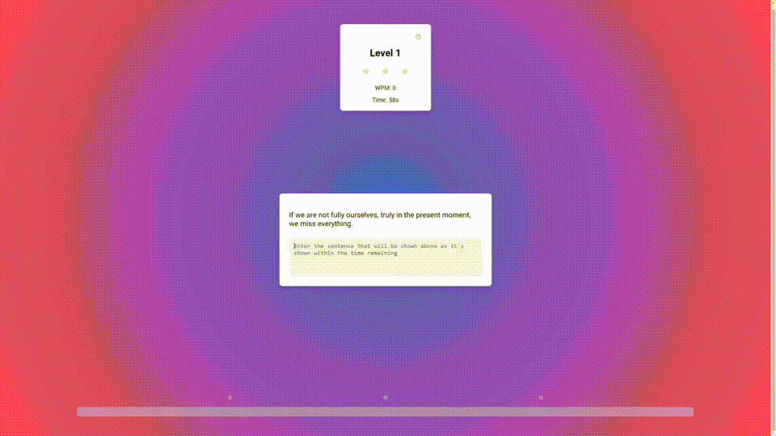

# The Typing Game


## About
This game was built as a project for my General Assembly SEI Class and as a fun way to test myself (and others) on their typing speed. Your words per minute will be tracked along as you play, so try to get the highest score you can.

## How To Play
Once you hit the start button, your quote will appear above the text box and the timer will start counting down. Finish typing the quote within the alloted time and you will be rewarded with stars! Collect three stars and move on to the next level. The amount of time provided will decrease with each level, so watch out!

The game is six levels long, where in the final level you will be allocated 30 seconds to type each of the quotes.

## Features
This project was built using the Random Quotes API, Quotable to provide the user with different quotes to type, chosen at random. The link to their GitHub is linked [here](https://github.com/lukePeavey/quotable).

### Code Example
```JavaScript
  async function getQuote() {
    typeString.textContent = ""; // Resets Quote
    const response = await fetch("https://api.quotable.io/random"); // https://github.com/lukePeavey/quotable
    const data = await response.json();
    if (response.ok) {
      currentQuote = data.content;
    }
  }
```

## Technologies Used
The Typing Game was built using vanilla JavaScript, with DOM manipulation bringing most of the functionality to the application.
